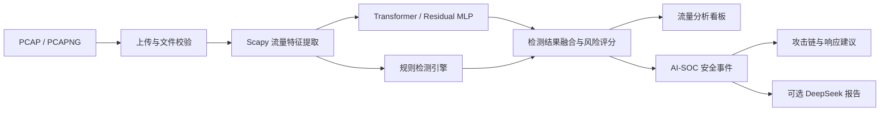

# 流盾 AI-SOC 恶意流量检测平台

基于 Flask、深度学习与网络流量分析构建的 AI-SOC 平台，支持 PCAP/PCAPNG 离线检测、网络流量分类、风险评估、安全事件管理以及可选的 AI 辅助安全报告生成。

> 本项目用于网络安全学习、流量分析和防御性研究。请仅分析自己拥有或已获得明确授权的网络与数据。

## 功能特性

- 上传并分析 `.pcap`、`.pcapng` 网络抓包文件
- 使用 Transformer 模型检测恶意网络流量
- 支持 Residual MLP 作为备用检测后端
- 识别 Normal、DDoS、DoS、PortScan、BruteForce、Malware、WebAttack 等流量类别
- 结合模型结果与规则引擎进行风险评分和检测融合
- 展示流量统计、攻击分布及安全分析看板
- 将检测结果转换为安全事件并跟踪处置状态
- 提供攻击说明、攻击链映射和响应建议
- 可选接入 DeepSeek，生成 AI 辅助安全事件报告
- 支持普通用户、管理员、登录保护和用户管理
- 对上传文件执行扩展名、文件头及安全路径检查

## 系统架构



## 技术栈

- Web：Flask、Jinja2、Bootstrap、jQuery
- 数据库：SQLite（默认）或 MySQL
- ORM 与迁移：Flask-SQLAlchemy、Flask-Migrate、Alembic
- 流量处理：Scapy、Pandas、NumPy
- 机器学习：PyTorch、scikit-learn、Joblib
- AI 报告：DeepSeek OpenAI 兼容接口（可选）

## 项目结构

```text
.
├── app.py                       # Flask 应用入口
├── config.py                    # 环境变量与应用配置
├── blueprints/                  # 登录、管理、检测、看板和 SOC 路由
├── utils/
│   ├── ai_soc/                  # 事件分析、攻击链、报告生成
│   ├── security/                # 风险评分、规则引擎、上传校验
│   ├── transformer_detector.py  # Transformer 推理
│   └── residual_mlp_detector.py # Residual MLP 推理
├── models/                      # 模型权重与特征缩放器
├── migrations/                  # 数据库迁移脚本
├── templates/                   # Jinja2 页面模板
├── static/                      # CSS、JavaScript 和图片资源
├── tools/                       # 测试抓包生成与模型验证工具
├── data/                        # 威胁情报示例数据
├── requirements.txt             # Python 依赖
└── .env.example                 # 安全的环境变量模板
```

运行时产生的 `.env`、数据库、上传文件、网络抓包、输出结果和本地训练数据均已通过 `.gitignore` 排除。

## 快速开始

### 1. 环境要求

- Python 3.10 或 3.11
- Git
- Windows、Linux 或 macOS
- 实时抓包功能可能需要 Npcap/libpcap 与管理员权限；只做离线 PCAP 分析时无需启用实时抓包

### 2. 克隆项目

```bash
git clone https://github.com/YES123AS/FlowShield-AI-SOC.git
cd FlowShield-AI-SOC
```

### 3. 创建虚拟环境

Windows PowerShell：

```powershell
python -m venv .venv
.\.venv\Scripts\Activate.ps1
python -m pip install --upgrade pip
pip install -r requirements.txt
```

Linux/macOS：

```bash
python3 -m venv .venv
source .venv/bin/activate
python -m pip install --upgrade pip
pip install -r requirements.txt
```

### 4. 配置环境变量

Windows PowerShell：

```powershell
Copy-Item .env.example .env
python -c "import secrets; print(secrets.token_urlsafe(48))"
```

Linux/macOS：

```bash
cp .env.example .env
python -c "import secrets; print(secrets.token_urlsafe(48))"
```

将生成的随机字符串填入 `.env` 的 `SECRET_KEY`。同时设置独立的管理员用户名和强密码：

```dotenv
SECRET_KEY=替换为随机生成的密钥
ADMIN_USERNAME=替换为管理员用户名
ADMIN_PASSWORD=替换为强密码
AUTO_CREATE_ADMIN=false
```

不要提交 `.env`，也不要把真实密码或 API Key 写入代码、文档、Issue 或截图。

### 5. 初始化数据库和管理员

默认使用 SQLite：

```powershell
$env:FLASK_APP = "app.py"
flask db upgrade
python create_admin.py
```

Linux/macOS：

```bash
export FLASK_APP=app.py
flask db upgrade
python create_admin.py
```

如需使用 MySQL，请先创建数据库，再在 `.env` 中启用并填写以下配置：

```dotenv
DB_ENGINE=mysql
DB_HOST=127.0.0.1
DB_PORT=3306
DB_NAME=traffic_system
DB_USER=替换为数据库用户
DB_PASSWORD=替换为数据库强密码
```

### 6. 启动应用

```bash
python app.py
```

该命令用于本地开发与演示；生产部署请使用生产级 WSGI 服务。

浏览器访问：<http://127.0.0.1:5001>

## 基本使用流程

1. 使用管理员账号或注册的普通用户登录。
2. 在离线检测页面上传授权使用的 PCAP/PCAPNG 文件。
3. 查看攻击类型、恶意流量占比、风险评分和检测依据。
4. 在分析看板中查看流量统计与攻击分布。
5. 将需要跟踪的检测记录转换为 SOC 安全事件。
6. 查看攻击链、处置建议和历史关联信息。
7. 如已安全配置 DeepSeek，可生成或重新生成 AI 辅助报告。

## 检测模型

默认检测后端为 Transformer：

```dotenv
DETECTOR_BACKEND=transformer
TRANSFORMER_MODEL_PATH=models/transformer_best.pt
TRANSFORMER_SCALER_PATH=models/scaler.joblib
TRANSFORMER_BATCH_SIZE=512
TRANSFORMER_MALICIOUS_FLOW_THRESHOLD=0.30
TRANSFORMER_DRIFT_Z_THRESHOLD=8.0
```

切换到 Residual MLP：

```dotenv
DETECTOR_BACKEND=residual_mlp
RESIDUAL_MLP_MODEL_PATH=models/residual_mlp_best.pt
RESIDUAL_MLP_SCALER_PATH=models/scaler.joblib
```

模型权重必须与训练阶段使用的特征顺序、缩放器和类别定义保持一致。

## 可选的 DeepSeek 报告

DeepSeek 默认关闭。请先在服务商控制台创建一枚新的 API Key，只将其保存在本机 `.env` 中：

```dotenv
DEEPSEEK_API_KEY=替换为新创建的APIKey
DEEPSEEK_BASE_URL=https://api.deepseek.com
DEEPSEEK_MODEL=deepseek-v4-pro
DEEPSEEK_ENABLE=true
```

如果 Key 曾经出现在公开仓库、提交历史、聊天记录或截图中，应立即吊销并重新创建。

## 模型与抓包验证

项目提供了测试流量生成与验证脚本：

```bash
python tools/generate_model_test_pcaps.py
python tools/validate_model_test_pcaps.py
```

生成的 PCAP 文件默认不进入 Git。测试数据和模型结果仅用于验证检测流程，不代表生产环境中的准确率承诺。

## 安全与隐私

- 仅上传经过授权且完成脱敏的网络抓包
- PCAP 可能包含 IP、MAC、域名、明文协议内容及其他敏感数据
- 不要提交 `.env`、数据库、运行日志、用户上传或抓包目录
- 不要复用示例用户名、密码或应用密钥
- 生产环境应关闭 Flask 调试模式，并使用反向代理与生产级 WSGI 服务
- 部署前应配置 HTTPS、访问控制、日志留存策略和数据库备份
- AI 生成内容仅作为辅助分析，不能替代人工研判

发布仓库前请参考 [PUBLISHING.md](PUBLISHING.md)。

## 许可证

本项目目前尚未添加开源许可证。在添加明确的 `LICENSE` 文件前，默认保留所有权利。

## 免责声明

本项目仅用于合法授权的网络安全教学、防御、研究和测试。使用者应遵守适用法律法规，并自行承担使用本项目所产生的责任。项目作者不对未经授权的流量采集、数据处理或其他滥用行为负责。
